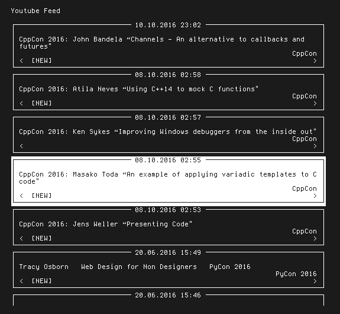

# youtube_feed

youtube_feed.py is a simple python scripts which allows to subscribe to youtube channels without an account.

### Add a channel to your subcription list
```
python youtube_feed.py -a "name of the channel"
```

### Remove a channel from your subscription list
```
python youtube_feed.py -r "name of the channel"
```

### List all channels in your subscription list
```
python youtube_feed.py -l
```

### Show your personal Youtube feed
```
python youtube_feed.py -s
```



### Show the help message
```
python youtube_feed.py -h
```
